<div align="center">

# leftover

**Local multi-model collab on the CLIs you already pay for.**

[](https://github.com/XR-Lee/leftover/actions/workflows/ci.yml)
[](pyproject.toml)
[](LICENSE)



</div>

Grok Heavy-style discussion and co-writing, on this Mac. Codex, Grok Build,
Cursor, Antigravity, and Claude sit in **one leftover conversation**. Not a
cloud mix. Not a second TUI.

```
leftover /heavy should we split the worker
→ Grok, Claude  (heavy)

leftover "migrate sessions onto JWT"
leftover · Cursor
```

You already pay for several coding subscriptions. Each one meters a window —
5 hours, a week, a month — and every window you underuse expires quietly.
leftover spends the one that is rotting. When the work is a question or a
shared draft, it puts two or more official CLIs in the same parent
conversation: discuss, then write.

Closest analog is [usher](https://github.com/theodorebeaupre-prog/usher)
(launcher → official TUI). leftover does not rewrite that. `--tui` is that
path. What usher does not do: remaining quota, lag+waste, and this local
multi-model collab.

`macbot` is a one-minor-version alias.

## Local multi-model collab

This is leftover **heavy**. Same idea as a Grok Heavy thread — discuss a
problem, or write and build together — except the speakers are the official
CLIs already logged in on this machine.

```
leftover /heavy should we split the worker
leftover --heavy "一起写 auth 文档"
you> /heavy 该不该上 JWT
you> should we extract a worker?
```

Two or more installed CLIs think independently in parallel, then compare
notes in parallel. Grok is the leader when it is installed and synthesizes
the conclusion; only the leader writes the working directory. One CLI still
works: leftover degrades to a single heavy worker instead of failing.

Questions and collab phrases (`should we`, `一起写`, `该不该`, a `?`) route
here. `fix the tests` stays coding. `/rt` `/debate` `/relay` `/all` stay
the sharper group tools.

## Rules

| Task | Who |
|---|---|
| Default coding | Highest lag+waste among `codex`, `grok`, `cursor-agent --model grok-4.6`, `agy --model gemini-3.1-pro-high`. A successful in-process coding session stays on its backend; independent commands re-rank. |
| `/heavy` or `should we` / `一起写` / `?` | Local collab. Grok leads; independent takes and compare-notes run in parallel. One CLI is enough. |
| `/plan` | Claude first. Coding pool if Claude is out. |
| `/cu` or “computer use / 点界面” | Codex CLI only. |
| `@codex` `@grok` `@cursor` `@antigravity` `@claude` | Named beat scores. |

Cursor Ultra coding stays on first-party Grok; Antigravity stays on
first-party Gemini. Neither gets sent onto another vendor's models — that
spends their third-party pool instead of the subscription you are trying
to use up.

## Install

```bash
# official CLIs, already logged in: claude / codex / grok / cursor-agent / agy
python3 -m venv .venv && source .venv/bin/activate
pip install -e .

leftover doctor
leftover install-skills   # leftover answers from every official CLI
leftover scope            # later: turn that off, per CLI
```

Copy `leftover.example.toml` to `~/.config/leftover/leftover.toml` if you want
overrides. The five built-in agents work with no config; any CLI you have not
installed simply shows as `not installed` and is skipped. The frozen Telegram
transport is an extra: `pip install -e '.[telegram]'`.

## Usage

You are talking to **leftover**. Codex / Grok / Cursor / Antigravity / Claude
are subagents it spawns.

```bash
cd your-repo
leftover
you> swap session for JWT, keep tests green
you> /heavy should we split the worker
you> /cu click through signup
you> /quit
```

| Command | What |
|---|---|
| (type) | coding, pick, continue in this conversation |
| `/heavy …` | local multi-model collab: parallel independent takes, then parallel compare-notes |
| `/plan …` | Claude plans |
| `/cu …` | Codex computer use |
| `/rt …` | roundtable |
| `/debate …` | two argue, third judges |
| `/relay …` | plan → implement → review |
| `/all …` | parallel, independent |
| `/quota` `/cd` `/reset` `/who` `/quit` | quota, workdir, reset, exit |
| `/scope` or `leftover scope` | leftover's skill in other CLIs: on or off, per CLI |
| `--tui` | exec into the winner's own UI (usher's path) |
| `-p` / `--print` | headless; stdout is the answer |
| `--why` | lag+waste table |
| `leftover quota --json` / `--why --json` | same windows / scores, scriptable |
| `--pick --json` | skill ABI |

## Skill scope

`leftover install-skills` drops leftover into each official CLI. After that,
Grok / Codex / Claude / Cursor / Antigravity ask leftover where work should
go. That hijack is optional and reversible.

```
leftover scope                 # TTY switches, or a table if not a TTY
leftover scope off grok        # Grok works on its own
leftover scope on cursor       # leftover answers from Cursor again
leftover scope off             # remove leftover from every CLI
leftover scope --json
```

On a TTY the panel is five rows: `space` toggles, `j`/`k` move, `a` all on,
`n` none, `q` done. Each toggle immediately links or unlinks
`~/.codex|/.grok|/.claude|/.cursor|/.agents/skills/leftover/`. Disk is the
source of truth. `--tui` is still the vendor TUI; this panel is not a second
chat product.

## Runtime guarantees

- ACP is preferred when available. Cursor and Codex keep their native ACP runner and session across explicit turns; exec is only a startup fallback or an explicit override.
- A full-turn or ACP-idle timeout ends that request and is never replayed on another backend. The turn deadline is silence since the last visible update or in-flight tool, not a wall clock from start. Idle hang detection pauses while a tool is in-flight (a quiet `pytest` is work, not a hang) and resumes when that tool completes. Fast startup, authentication, quota, and transient failures may still follow the configured fallback chain.
- Quiet `--print` routes report route/attempt/tool progress and a 30-second heartbeat on stderr. Stdout remains answer-only.
- Skill handoffs wait on the returned process handle; they never defer the next check from a model-generated duration estimate. If an exec leader exits while descendants retain its pipes, leftover reaps that process group and returns the captured answer immediately.
- `/all` workers and `/debate` advocates run in parallel, but each completed answer is emitted as one grouped block. Debate roles and event delivery have finite deadlines.
- Shutdown rejects work that was already queued and bounds transport cleanup. `/cd` waits for active work, then later operations start only in the new directory.

Seat line (usher-shaped, leftover axis):

```
→ Codex  (coding · lag+waste · override with @name)
```

## Score

- **lag** = `max(0, elapsed fraction − used fraction)`
- **waste** = `behind-schedule fraction / hours until reset`
- **total** = `0.5 * lag + 1.0 * waste`

A fresh short window starts at zero urgency. If it remains unused, its lag and catch-up rate rise; near reset it still beats a relaxed monthly pool. Estimated budgets have `waste = 0`.

## What it touches

leftover has no server, no account, and no telemetry. It reads the vendor logins
you already have to ask each vendor how much of *your* window is left, and it
starts every subagent with that CLI's permission prompts turned off.

Read [SECURITY.md](SECURITY.md) before you run it. It lists every file read,
every host contacted, and every auto-approve flag.

## Docs

| Doc | Use when |
|---|---|
| [Core features](docs/core-features.md) | What the product is |
| [Roadmap](docs/roadmap.md) | What to grow. What to refuse |
| [Architecture](docs/architecture.md) | Module map |
| [Maintenance](docs/maintenance.md) | Invariants and tests |
| [Security](SECURITY.md) | What it reads, sends, writes |
| [Decisions](docs/history/decisions.md) | Why |

```bash
python tests/test_macbot.py
python tests/test_routing.py
python tests/test_e2e.py
python tests/test_reliability.py
python tests/test_state_reliability.py
```

No network, no vendor CLI, no subscription spend — the suites run on mocks.

MIT. Contributions: read [CONTRIBUTING.md](CONTRIBUTING.md) first — leftover
stays a thin router.
